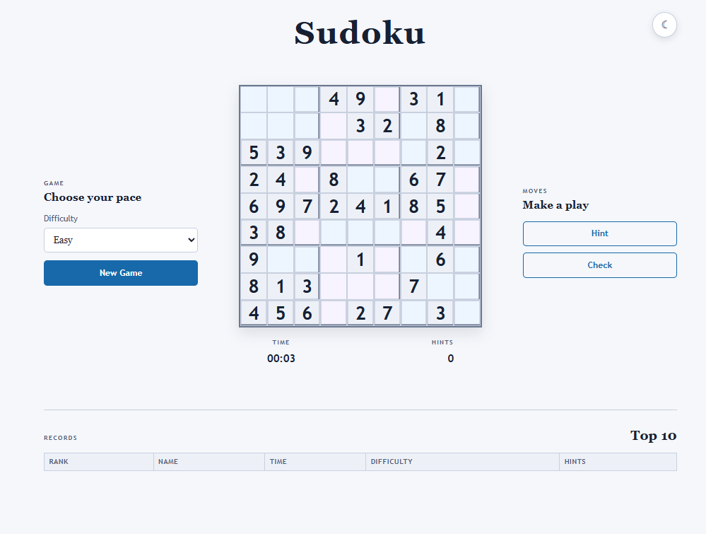
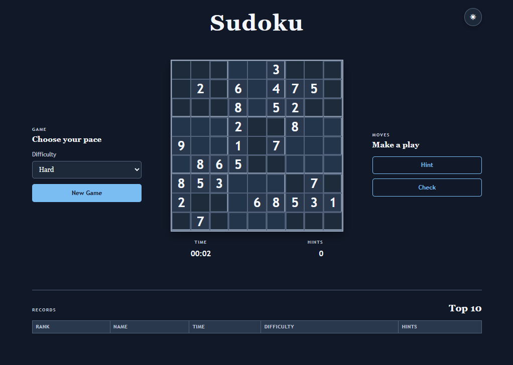
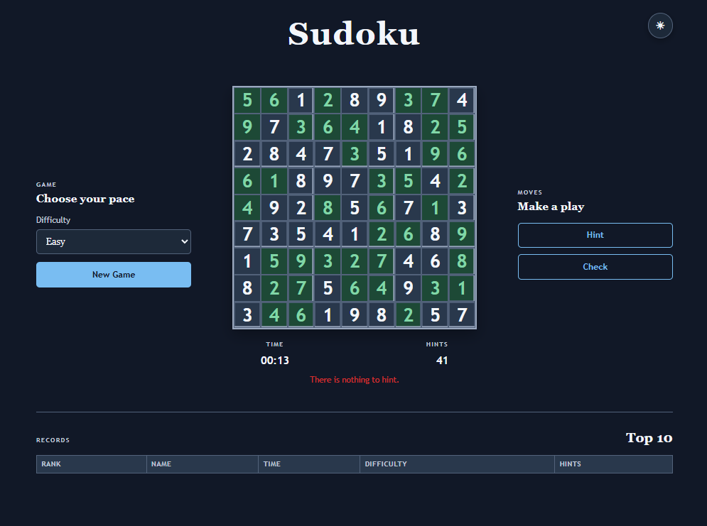
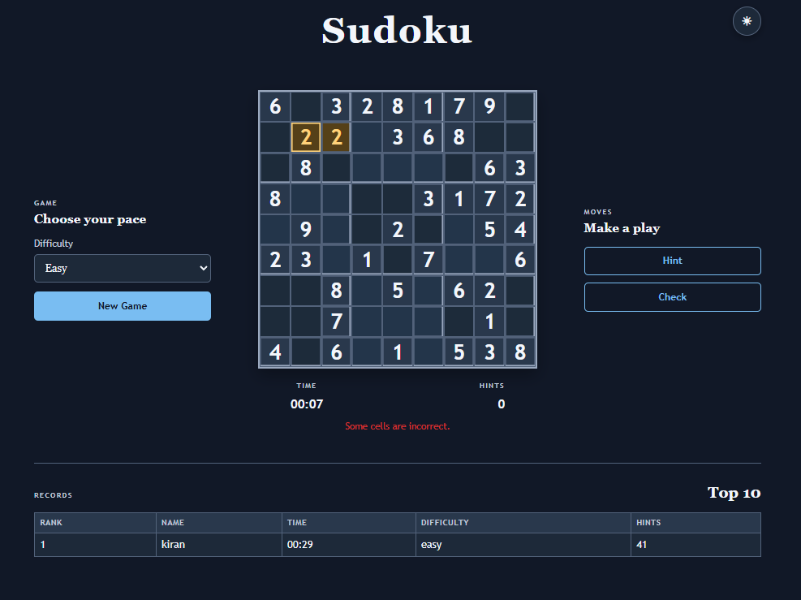
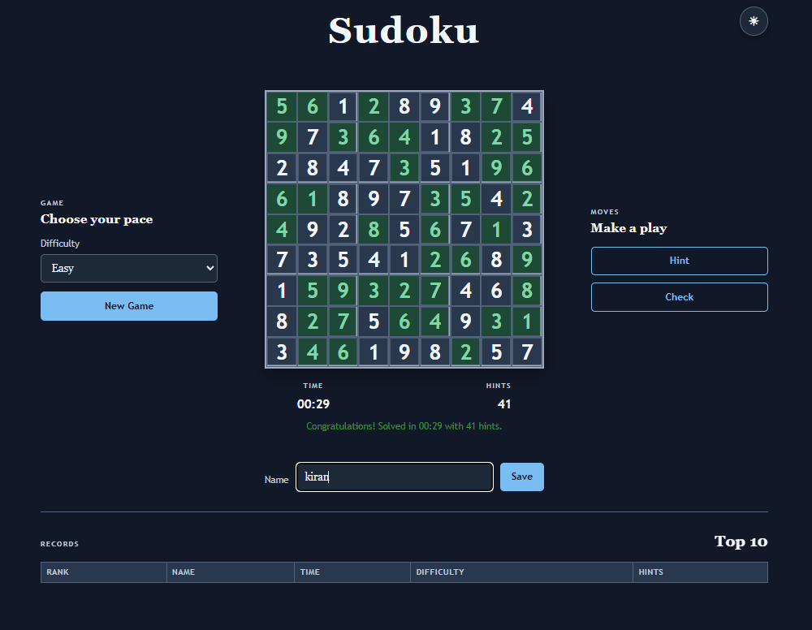
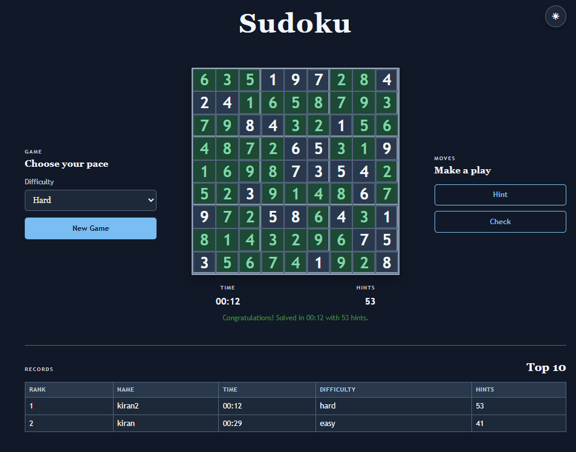

# Refactor a Sudoku Game written in Python Flask

Use this simple Sudoku game as a starting point to practice your skills with GitHub Copilot. The goal is to refactor the code to use modern technologies, while also adding new features and improving the overall user experience.

## 1. Overview

This project is a Flask-based Sudoku game with a Python backend and a lightweight browser UI built with vanilla JavaScript, CSS, and HTML templates. The backend generates a valid Sudoku board, preserves a unique solution, and serves puzzle data to the front end. The browser handles input validation, conflict highlighting, hint requests, timer updates, and the local Top 10 scoreboard.

The app is intentionally small and focused: the board state is kept in memory on the server for the active game, the rules live in sudoku_logic.py, and the UI is split between templates/index.html, static/main.js, static/scoreboard.js, and static/styles.css. The implemented behavior matches the feature set described below and is validated by pytest tests under starter/tests.

## 2. Features

- Difficulty levels: Easy, Medium, and Hard are mapped to clue counts of 40, 32, and 28 in the backend.
- Unique-solution puzzles: generated puzzles are created by filling a valid board and removing cells while maintaining exactly one valid completion.
- Locked prefilled cells: starting clues are rendered as disabled inputs and styled as fixed puzzle cells.
- Conflict highlighting: duplicate values in the same row, column, or 3x3 box are shown with a conflict style during typing.
- Check: the Check button compares the current board to the solution and highlights incorrect editable cells.
- Hint: a hint fills one empty or incorrect editable cell with the correct solution value, locks it, and tracks the number of hints used.
- Timer: a game timer starts when a new puzzle loads and stops when the puzzle is solved.
- Top 10 in localStorage: scoreboard entries store name, time, difficulty, hints, and a date; the list is capped at 10 entries and sorted by time, then hints.
- Dark mode toggle: a theme button toggles a dark-mode class on the body and stores the preference in localStorage when available.
- Alternating 3x3 colours: each 3x3 region alternates between two background styles for readability.
- Responsive layout: the game layout collapses gracefully on narrower screens, keeping controls and board readable on mobile devices.
- Completion message: when the puzzle is solved, the app shows a success message with elapsed time and hint count and asks for a name if the score qualifies for the Top 10.
- Number tracking: buttons 1-9 show how many of each digit remain, highlight every matching cell, and are marked complete when all nine are placed.

## 3. Setup and run

Windows commands:

1. Open a terminal in the repository root.
2. Change into the starter folder:
   cd starter
3. Create and activate a virtual environment:
   python -m venv .venv
   .venv\Scripts\activate.bat        (cmd)
   .venv\Scripts\Activate.ps1        (PowerShell)
4. Install dependencies:
   pip install -r requirements.txt
5. Start the app:
   python app.py
6. Open the browser at:
   http://127.0.0.1:5000

The app assumes Python 3 is available and that the dependencies listed in starter/requirements.txt are installed before running the Flask server.

## 4. Running tests

From the starter directory, with the virtual environment activated:

python -m pytest tests

This project uses pytest for both backend logic and route-level behavior.

## 5. Project structure

- app.py: Flask routes for the home page, new game generation, solution checking, and hints.
- sudoku_logic.py: board generation, validation, puzzle creation, uniqueness checks, and hint selection logic.
- templates/index.html: page structure for the Sudoku board, timer, theme control, controls, and scoreboard.
- static/main.js: interactive board logic, timer, hint flow, checks, and theme handling.
- static/scoreboard.js: localStorage score loading, saving, sorting, and Top 10 logic.
- static/styles.css: board styling, alternating 3x3 grid colours, dark theme, and responsive layout rules.
- tests/test_app.py: Flask route tests for puzzle generation, validation, hints, and the interaction contract.
- tests/test_sudoku_logic.py: Sudoku generation and validation tests, including puzzle uniqueness and clue-count checks.
- instruction.md: visible copy of the Copilot instruction file (the copy Copilot loads automatically is .github/copilot-instructions.md).
- .github/copilot-instructions.md: project instructions used to guide Copilot-driven development.
- Screenshots/: milestone images documenting the design and review process.
- prompts.json: the Copilot prompts used in this project, kept as reusable templates, with the mode, milestone and matching screenshots for each.

## 6. Design notes

- Event delegation on the board: the board-level input listener in static/main.js reacts to input events from board cells, filters only real sudoku-cell inputs, and avoids attaching a separate handler to every individual cell.
- Graceful error handling: the Flask routes return JSON errors with explicit HTTP status codes for invalid inputs, missing games, and unsupported difficulty values. The browser also catches JSON responses and displays a user-facing error message when a request fails.
- localStorage safety: score and theme reads/writes are wrapped in try/catch blocks so unavailability of browser storage does not crash the app.
- Difficulty mapping in the backend: the server maps difficulty names to clue counts using DIFFICULTY_CLUES in sudoku_logic.py, which keeps the frontend selector and puzzle generation rules in sync.

## 7. How GitHub Copilot was used

The repository guidance in .github/copilot-instructions.md set the foundation for the work: the project was to stay in Flask with vanilla JavaScript, keep the Sudoku rules in sudoku_logic.py, and return JSON errors with appropriate HTTP status codes. I used Copilot iteratively to propose tests, explore generation strategies, and refine UI behavior while keeping the app aligned with those constraints.

Milestone 1: Testing framework and baseline behavior. I used Copilot to establish the pytest setup and verify a minimal baseline for the Flask app before adding functionality. Screenshots: 01_testing_framework_prompt.png, 01_testing_framework_result-1.png, 01_testing_framework_result-2.png, initial_tests.png.

Milestone 2: Unique-solution puzzle generation. Copilot helped me shape the generation strategy so that puzzles were valid and had exactly one solution while still meeting the desired clue count. Screenshots: 02_unique_solution_prompt.png, 02_unique_solution_plan-1.png, 02_unique_solution_plan-2.png, 02_unique_solution_plan-3.png, 02_unique_solution_result-1.png, 02_unique_solution_result-2.png, 02_unique_solution_tests.png, 02_unique_solution_timing.png.

Milestone 3: Difficulty selector and mapping. The app gained a difficulty picker and backend clue-count mapping with Copilot helping to keep the game generation and the UI consistent. Screenshots: 03_difficulty_selector_prompt.png, 03_difficulty_comment_review.png, 03_difficulty_selector_result-1.png, 03_difficulty_selector_result-2.png, 03_difficulty_selector_result-3.png, 03_difficulty_tests.png.

Milestone 4: Validation and conflict feedback. Copilot suggested the validation and board conflict logic that checks duplicates and gives immediate feedback without overloading the page with per-cell handlers. Screenshots: 04_input_validation_prompt.png, 04_conflict_highlight_ui.png, 04_input_validation_result-1.png, 04_input_validation_result-2.png, 04_input_validation_tests.png.

Milestone 5: Hint, timer, and completion message. This milestone covered the game flow around hint requests, elapsed time tracking, and the final success state. Screenshots: 05_hint_timer_prompt.png, 05_completion_message_ui.png, 05_hint_ui.png, 05_hint_timer_result-1.png, 05_hint_timer_result-2.png, 05_hint_timer_result-3.png, 05_hint_timer_result-4.png, 05_hint_timer_tests.png.

Milestone 6: Local scoreboard and storage. Copilot assisted with the top-ten score logic, localStorage guarding, and the score-entry flow after a successful solve. Screenshots: 06_localstorage_devtools.png, 06_scoreboard_prompt.png, 06_scoreboard_ui.png, 06_scoreboard_result-1.png, 06_scoreboard_result-2.png, 06_scoreboard_result-3.png, 06_scoreboard_result-4.png, 06_scoreboard_tests.png.

Milestone 7: Theme and responsive layout. The final UI polish focused on dark mode, alternated 3x3 box colours, and mobile-friendly sizing. Screenshots: 07_layout_theme_prompt.png, 07_dark_mode_ui.png, 07_light_mode_ui.png, 07_layout_theme_result-1.png, 07_layout_theme_result-2.png, 08_grid_colors_prompt.png, 08_grid_colors_result-1.png, 08_grid_colors_result-2.png, 08_mobile_view_ui.png.

Milestone 8: Number tracking (stand-out feature). Nine digit buttons under the board show how many of each digit remain, highlight every matching cell when clicked, and are marked complete once all nine are placed. It uses a single delegated click handler and updates after input, hints and new games. Screenshots: 09_number_tracking_prompt.png, 09_number_tracking_result.png, 09_number_tracking_ui.png.

Milestone 9: Instruction file and accessibility review. Copilot Chat confirmed it follows the project instruction file, which lives at .github/copilot-instructions.md, where Copilot loads it automatically, with a visible copy at instruction.md in the repository root (Screenshots/10_instruction_file_used.png). I then asked Copilot for a WCAG 2.1 AA review, applied part of it and rejected part of it (Screenshots/10_wcag_suggestions.png, 10_wcag_review_prompt_and_answer.png, 10_evaluation_code_comment.png).

### Suggestions I evaluated, changed or rejected

- Plan review (accepted after checking). In Ask mode, Copilot proposed raising ValueError for clue counts it could not reach, instead of returning a puzzle with extra clues, because extra clues would break the existing exact-clue-count tests. I checked that against the tests, agreed, and had /new turn the error into a JSON 500 response (Screenshots/02_unique_solution_plan-3.png).
- Difficulty clue counts (reviewed and tuned). I left a review comment above DIFFICULTY_CLUES in sudoku_logic.py (Screenshots/03_difficulty_comment_review.png). I chose 28 clues for Hard after timing generation at 40, 32, 28 and 26 clues (Screenshots/02_unique_solution_timing.png), because 26 clues was noticeably slower.
- Missing import in generated tests (fixed). In two milestones Copilot generated a test file that used pytest without importing it and failed with a NameError. I had Copilot fix it and re-run the suite.
- Hint test assumption (corrected). Copilot's first /hint test assumed the hint would land on the first empty cell. I had it change the assertion to check that the returned cell is editable and that its value matches the solution.
- WCAG review (accepted in part). Copilot suggested 12 changes. I accepted 1 (visible focus styles), 3 (status text not conveyed by colour alone), 4 (live status messages), 5 (labelled score form and difficulty selector) and 7 (numeric input mode); suggestion 2 (cell labels) was already in place. I rejected suggestion 6 (custom arrow-key navigation model) because the cells are native inputs that are already keyboard-reachable with Tab, and the change is large and risks breaking the delegated input listener. I left 8 to 12 for a later pass to keep this change small. See Screenshots/10_wcag_suggestions.png, 10_wcag_review_prompt_and_answer.png and 10_evaluation_code_comment.png.

## 8. Screenshots of the finished game

